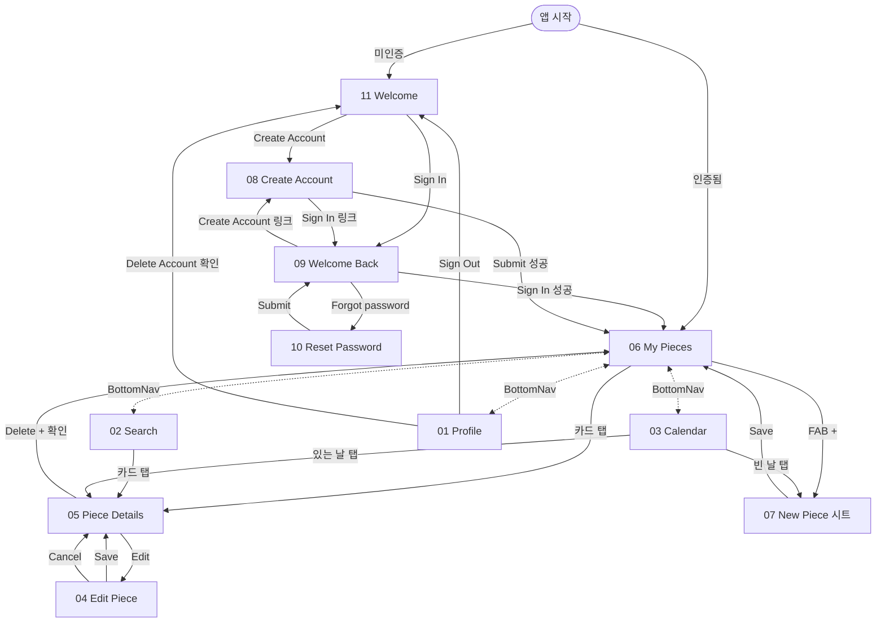

# DailyPiece — Screen Index

## 📊 현재 상태

- ✅ Documented: **11 / 11**
- ✅ 정밀 재명세 완료: **11 / 11** — 모든 화면 스크린샷 / Figma 기반 정밀 명세
- ✅ 코드 리뉴얼 완료: **11 / 11** — 명세대로 구현 합쳐짐 (2026-05-11)

DailyPiece 앱은 인증 흐름 4 화면(Welcome / Sign In / Sign Up / Reset Password) + 메인 앱 7 화면(BottomNav 탭 4 + New Piece 시트 + Edit Piece + Piece Details)으로 구성.

---

## 명세 ↔ 구현 매핑

| 명세 (Spec)       | 구현 (Built)             | 코드 위치                                                                                                                                      | 비고                                                                                                               |
| ----------------- | ------------------------ | ---------------------------------------------------------------------------------------------------------------------------------------------- | ------------------------------------------------------------------------------------------------------------------ |
| 01 Profile        | **ProfilePage**          | [`features/profile/presentation/pages/profile_page.dart`](../../lib/features/profile/presentation/pages/profile_page.dart)                     | Profile / Settings / Account 카드 + 버전 풋터. Export Data·Delete Account는 의도적 미구현. App Theme은 cycle       |
| 02 Search         | **SearchPage**           | [`features/search/presentation/pages/search_page.dart`](../../lib/features/search/presentation/pages/search_page.dart)                         | Caption substring + 동적 월 칩 (사용자의 piece 보유 월). 결과는 가로 카드. 서버사이드 검색 (`search(query, year, month)`) |
| 03 Calendar       | **CalendarPage**         | [`features/calendar/presentation/pages/calendar_page.dart`](../../lib/features/calendar/presentation/pages/calendar_page.dart)                 | 7-col 그리드 + 5-state 셀 + InfoCard. 빈 칸 탭 → 날짜 prefill된 New Piece 시트                                     |
| 04 Edit Piece     | **EditPiecePage** (별도) | [`features/edit_piece/presentation/pages/edit_piece_page.dart`](../../lib/features/edit_piece/presentation/pages/edit_piece_page.dart)         | `/piece/:id/edit` 공용 경로 + `/my-pieces/:id/edit` 탭 내부 경로. TopBar Cancel/Save text + Photo Required + Replace Photo + Caption counter |
| 05 Piece Details  | **PieceDetailPage**      | [`features/piece_detail/presentation/pages/piece_detail_page.dart`](../../lib/features/piece_detail/presentation/pages/piece_detail_page.dart) | 사진 + 코멘트 + 메타. Edit/Delete tile 행. 인라인 edit는 04로 분리                                                 |
| 06 My Pieces      | **MyPiecesPage**         | [`features/my_pieces/presentation/pages/my_pieces_page.dart`](../../lib/features/my_pieces/presentation/pages/my_pieces_page.dart)             | AppBar(DailyPiece + 월 라벨 + 종 아이콘) + 풀폭 카드 피드 + FAB(+) → New Piece 시트                                |
| 07 New Piece      | **NewPieceSheet** (시트) | [`features/new_piece/presentation/widgets/new_piece_sheet.dart`](../../lib/features/new_piece/presentation/widgets/new_piece_sheet.dart)       | `showModalBottomSheet`. 라우트 없음 — FAB / Calendar 빈칸 탭 / EmptyView CTA에서 호출. `forDate` 옵션 prefill 지원 |
| 08 Create Account | **SignUpPage**           | [`features/auth/presentation/pages/sign_up_page.dart`](../../lib/features/auth/presentation/pages/sign_up_page.dart)                           | Name(Optional) / Email / Password(≥8) / Confirm Password + 일치 검증 + ToS 풋터                                    |
| 09 Welcome Back   | **SignInPage**           | [`features/auth/presentation/pages/sign_in_page.dart`](../../lib/features/auth/presentation/pages/sign_in_page.dart)                           | Email / Password + Forgot password? → /reset-password + ToS 풋터                                                   |
| 10 Reset Password | **ResetPasswordPage**    | [`features/auth/presentation/pages/reset_password_page.dart`](../../lib/features/auth/presentation/pages/reset_password_page.dart)             | `auth.resetPasswordForEmail`. 성공/실패 모두 일반화된 메시지 (account-existence side-channel 회피)                 |
| 11 Welcome        | **WelcomePage**          | [`features/welcome/presentation/pages/welcome_page.dart`](../../lib/features/welcome/presentation/pages/welcome_page.dart)                     | 미인증 진입점. 라우터 redirect 타깃이 `/sign-in` → `/welcome`으로 이전                                             |
| BottomNav         | **MainShellPage** (4-탭) | [`app/shell/main_shell_page.dart`](../../lib/app/shell/main_shell_page.dart)                                                                   | My Pieces / Calendar / Search / Profile — 명세 100%                                                                |

레이아웃 컨벤션은 [ADR 0006](../adr/0006-clean-architecture-layout.md) 참고.

### 의도적 차이 (spec vs 코드)

- **App Theme 행 (01 Profile)**: 명세는 "Dark 잠금" 정적 표시. 코드는 기존 `themeModeController`가 작동하므로 tap-cycle (System → Light → Dark)로 유지. trailing 라벨이 현재 모드를 반영.
- **Export Data 행 (01 Profile)**: 의도적 미구현 — 명세에선 정의돼 있지만 v1 범위에서 제외. UI 행도 제거 (placeholder 행을 두는 것보다 낫다고 판단).
- **Delete Account 행 (01 Profile)**: 의도적 미구현 — Supabase admin endpoint 없이는 진짜 삭제가 안 됨. 가짜 삭제(=Sign Out)를 두는 게 더 위험하다고 판단해 행 자체를 제거.

---

## 🗂️ 스크린 목록 (Figma `8:2` 프레임 기준)

| #   | Screen         | Frame ID | 분류               | File                                         |
| --- | -------------- | -------- | ------------------ | -------------------------------------------- |
| 01  | Profile        | 2:4      | BottomNav 탭       | [01-profile.md](01-profile.md)               |
| 02  | Search         | 2:126    | BottomNav 탭       | [02-search.md](02-search.md)                 |
| 03  | Calendar       | 2:209    | BottomNav 탭       | [03-calendar.md](03-calendar.md)             |
| 04  | Edit Piece     | 2:367    | 콘텐츠 편집        | [04-edit-piece.md](04-edit-piece.md)         |
| 05  | Piece Details  | 2:412    | 콘텐츠 상세        | [05-piece-details.md](05-piece-details.md)   |
| 06  | My Pieces      | (8:2 외) | BottomNav 탭       | [06-my-pieces.md](06-my-pieces.md)           |
| 07  | New Piece      | 2:513    | 콘텐츠 작성 (시트) | [07-new-piece.md](07-new-piece.md)           |
| 08  | Create Account | 2:760    | 인증               | [08-create-account.md](08-create-account.md) |
| 09  | Welcome Back   | 2:812    | 인증 (Sign In)     | [09-welcome-back.md](09-welcome-back.md)     |
| 10  | Reset Password | 2:856    | 인증               | [10-reset-password.md](10-reset-password.md) |
| 11  | Welcome        | 2:738    | 인증 (미인증 진입) | [11-welcome.md](11-welcome.md)               |

---

## 🔁 화면 흐름

---

## 🛣️ 라우트 표

| Path                       | Page / Sheet                                              | 진입 가드                               |
| -------------------------- | --------------------------------------------------------- | --------------------------------------- |
| `/welcome`                 | WelcomePage                                               | 미인증 only                             |
| `/sign-in`                 | SignInPage                                                | 미인증 only                             |
| `/sign-up`                 | SignUpPage                                                | 미인증 only                             |
| `/reset-password`          | ResetPasswordPage                                         | 미인증 only                             |
| `/my-pieces`               | MyPiecesPage (shell branch 1)                             | 인증 only                               |
| `/my-pieces/:pieceId`      | PieceDetailPage (My Pieces 탭 내부 진입 경로)             | 인증 only                               |
| `/my-pieces/:pieceId/edit` | EditPiecePage (My Pieces 탭 내부 진입 경로)               | 인증 only                               |
| `/piece/:pieceId`          | PieceDetailPage (공용 상세 경로: Calendar/Search 탭 유지) | 인증 only                               |
| `/piece/:pieceId/edit`     | EditPiecePage (공용 상세 경로의 편집 하위 경로)           | 인증 only                               |
| `/calendar`                | CalendarPage (shell branch 2)                             | 인증 only                               |
| `/search`                  | SearchPage (shell branch 3)                               | 인증 only                               |
| `/profile`                 | ProfilePage (shell branch 4)                              | 인증 only                               |
| (route 없음)               | NewPieceSheet — `showNewPieceSheet(context, forDate?)`    | 인증 only (시트 호출 컨텍스트 안에서만) |

`initialLocation`: `/my-pieces`. 미인증 시 `/welcome`으로 redirect, 인증 시 `_publicPaths`(welcome/sign-in/sign-up/reset-password)에서 `/my-pieces`로 redirect.

---

## 📈 컴포넌트 사용 빈도 (10개 화면 종합)

| Component             | 사용 빈도 | 주요 위치                                   |
| --------------------- | --------- | ------------------------------------------- |
| `16-label.md`         | ~70       | 거의 모든 텍스트 슬롯                       |
| `01-button.md`        | ~12       | Save/Cancel/Sign In/Sign Out/Delete/Edit 등 |
| `02-text-field.md`    | ~10       | Search, Email, Password, Caption 등         |
| `09-icon-button.md`   | ~6        | Back, Replace Photo, Export 등              |
| `06-card.md`          | ~5        | My Pieces 리스트, Home 최근 카드            |
| `04-chip.md`          | 4         | Search 월별 필터                            |
| `13-switch.md`        | 1         | Profile 다크모드 (현재 코드는 cycle 사용)   |
| `15-avatar.md`        | 1         | Profile 헤더                                |
| `17-divider.md`       | 1         | Profile 섹션 구분                           |
| `10-textarea.md`      | 2         | New Piece, Edit Piece 캡션                  |
| `14-content-badge.md` | 1         | Edit Piece "Required" 배지                  |
| `18-alert.md` (참조)  | 2         | Delete Account, Delete Piece 확인           |

### Custom 영역 (DS 보강 후보)

| `<Custom>`                 | 등장 빈도         | DS 합류 후보                                                                                                                  |
| -------------------------- | ----------------- | ----------------------------------------------------------------------------------------------------------------------------- |
| ~~`BottomNavItem`~~        | ~~5 화면~~        | ✅ **합류 완료** → [components/23-bottom-navigation.md](../../design_system/docs/components/23-bottom-navigation.md)          |
| `DailyPieceThumbnail`      | 2~3               | Card thumbnail 합성 또는 별도 합류 후보                                                                                       |
| `DailyPiecePhoto`          | 1 (Piece Details) | 풀폭 hero photo — Custom 유지 가능                                                                                            |
| `CalendarDayCell`          | 1                 | 도메인 특화 — Custom 유지 (코드도 features/calendar 안에 둠)                                                                  |
| ~~`PhotoPickerSlot`~~      | ~~1~~             | ✅ **합류 완료** → [components/27-image-uploader.md](../../design_system/docs/components/27-image-uploader.md) (empty 모드)   |
| ~~`PhotoPreview`~~         | ~~1~~             | ✅ **합류 완료** → [components/27-image-uploader.md](../../design_system/docs/components/27-image-uploader.md) (preview 모드) |
| `AppLogoMark`              | 1 (Welcome)       | 도메인 자산 — Custom 유지                                                                                                     |
| `PasswordVisibilityToggle` | 2 (Auth)          | IconButton 합성으로 표현 가능 — Custom 유지 합리적                                                                            |

---

## 🚧 남은 후속 작업

리뉴얼은 끝났지만 아래 항목은 명세 대비 미완 / 추후 합류 대상:

1. **Calendar 인접 월 prefetch**: 좌우 스크러빙 시 미세 깜빡임. 현재 월 ± 1 미리 fetch 정책 검토.
2. **에러 surfacing 일관화**: inline `_error` 텍스트 + 일부 SnackBar 혼재. WdsSnackBar로 통일.
3. **위젯 테스트 확장**: 현재 라우팅 2개만. New Piece sheet 저장, Calendar 셀 탭, Search 필터 추가 권장.
4. **실기기 sweep**: 4-탭 / FAB / 시트 / Calendar / Search / Edit Piece 전부 디바이스에서 한 번 확인.
5. **App Theme 잠금**: 현재는 cycle. 잠금이 정말 필요하면 controller freeze + lock 아이콘으로 회귀.
6. **`DailyPieceThumbnail` / `CalendarDayCell` 합류**: Custom 표기 → 정식 DS 컴포넌트 검토.
7. **`PhotoPickerTile` dashed border**: 현재 solid. DS에 `DottedBorder` 추가 후 회귀하면 spec 100%.
