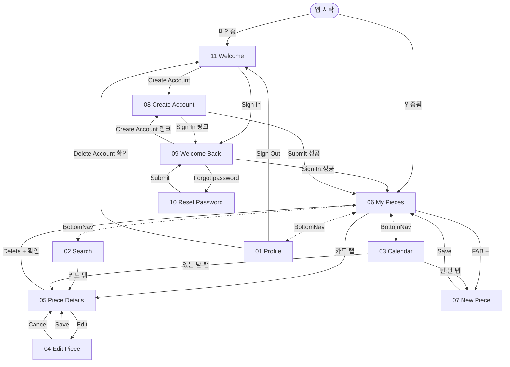

# DailyPiece — Screen Index

## 📊 현재 상태

- ✅ Documented: **11 / 11**
- ⚠️ 정밀 재명세 완료: **9** — 01 Profile · 03 Calendar · 04 Edit Piece · 05 Piece Details · 06 My Pieces · 07 New Piece · 08 Create Account · 09 Welcome Back · 11 Welcome
- 🟡 정밀 재명세 보류: **2** — 02 Search · 10 Reset Password (다음 스크린샷 또는 Figma 한도 회복 대기)

> **명세 vs 구현**: 본 명세는 **풀 디자인 타깃**. 현재 구현은 MVP 부분집합이다 — 매핑은 [`MVP 구현 매핑`](#mvp-구현-매핑) 섹션 참고. 명세는 그대로 두고, 구현이 따라잡으면 매핑 표를 갱신한다.

DailyPiece 앱은 인증 흐름 4 화면(Welcome/Sign In/Sign Up/Reset Password) + 메인 앱 6 화면(BottomNav 탭 4 + New Piece + Edit Piece + Piece Details)으로 구성. 단, BottomNav의 "My Pieces" 탭은 디자인 미확정.

---

## 명세 ↔ 구현 매핑

| 명세 (Spec)        | 구현 (Built)        | 코드 위치                                                                                                                                      | 비고                                                                                                |
| ------------------ | ------------------- | ---------------------------------------------------------------------------------------------------------------------------------------------- | --------------------------------------------------------------------------------------------------- |
| 01 Profile         | **SettingsPage**    | [`features/settings/presentation/pages/settings_page.dart`](../../lib/features/settings/presentation/pages/settings_page.dart)                 | 이름/경로 어긋남(`features/profile/`로 rename 예정). 콘텐츠도 명세의 Export Data·Delete Account 누락 |
| 02 Search          | ❌ 없음             | —                                                                                                                                              | 검색 입력 + 월 칩 + 결과 카드 — 미구현                                                              |
| 03 Calendar        | ❌ 없음             | —                                                                                                                                              | 미구현                                                                                              |
| 04 Edit Piece      | (Detail에 통합됨)   | [`features/piece_detail/presentation/widgets/detail_scaffold.dart`](../../lib/features/piece_detail/presentation/widgets/detail_scaffold.dart) | 명세는 별도 화면이지만 코드는 Detail의 인라인 edit 모드로 구현                                      |
| 05 Piece Details   | **PieceDetailPage** | [`features/piece_detail/presentation/pages/piece_detail_page.dart`](../../lib/features/piece_detail/presentation/pages/piece_detail_page.dart) | 사진 + 코멘트 + 날짜. edit / delete / 사진 교체 포함                                                |
| 06 My Pieces       | **CollectionPage**  | [`features/collection/presentation/pages/collection_page.dart`](../../lib/features/collection/presentation/pages/collection_page.dart)         | 명세 = **풀폭 큰 카드 + FAB**, 코드 = **3열 그리드**. 명세대로 회귀 필요 (디렉토리도 `my_pieces`로) |
| 07 New Piece       | (TodayPage에 흡수)  | [`features/today/presentation/pages/today_page.dart`](../../lib/features/today/presentation/pages/today_page.dart)                             | 명세는 별도 화면이지만 코드는 "오늘 자 piece"가 없을 때의 compose 모드로 표현                       |
| 08 Create Account  | **SignUpPage**      | [`features/auth/presentation/pages/sign_up_page.dart`](../../lib/features/auth/presentation/pages/sign_up_page.dart)                           | 이메일 + 비밀번호. 명세의 Name(Optional) / Confirm Password 누락                                    |
| 09 Welcome Back    | **SignInPage**      | [`features/auth/presentation/pages/sign_in_page.dart`](../../lib/features/auth/presentation/pages/sign_in_page.dart)                           | 이메일 + 비밀번호. Forgot password 링크 미구현                                                      |
| 10 Reset Password  | ❌ 없음             | —                                                                                                                                              | 미구현                                                                                              |
| 11 Welcome         | ❌ 없음             | —                                                                                                                                              | 미구현 — 라우터가 미인증 시 바로 /sign-in으로 redirect                                              |
| BottomNav          | **MainShellPage**   | [`app/shell/main_shell_page.dart`](../../lib/app/shell/main_shell_page.dart)                                                                   | **3-탭(Today / Collection / Settings)** ↔ 명세 **4-탭(My Pieces / Calendar / Search / Profile)**    |
| (명세 없음) Today  | **TodayPage**       | [`features/today/presentation/pages/today_page.dart`](../../lib/features/today/presentation/pages/today_page.dart)                             | 명세에 대응 화면 없음. 06 My Pieces / 07 New Piece / 04 Edit Piece를 합친 합성 화면(MVP 발명품)     |

레이아웃 컨벤션은 [ADR 0006](../adr/0006-clean-architecture-layout.md) 참고.

---

## 🗂️ 스크린 목록 (Figma `8:2` 프레임 기준)

| #   | Screen         | Frame ID | 분류                | File                                         |
| --- | -------------- | -------- | ------------------- | -------------------------------------------- |
| 01  | Profile        | 2:4      | BottomNav 탭        | [01-profile.md](01-profile.md)               |
| 02  | Search         | 2:126    | BottomNav 탭        | [02-search.md](02-search.md)                 |
| 03  | Calendar       | 2:209    | BottomNav 탭        | [03-calendar.md](03-calendar.md)             |
| 04  | Edit Piece     | 2:367    | 콘텐츠 편집         | [04-edit-piece.md](04-edit-piece.md)         |
| 05  | Piece Details  | 2:412    | 콘텐츠 상세         | [05-piece-details.md](05-piece-details.md)   |
| 06  | My Pieces      | (8:2 외) | BottomNav 탭        | [06-my-pieces.md](06-my-pieces.md)           |
| 07  | New Piece      | 2:513    | 콘텐츠 작성         | [07-new-piece.md](07-new-piece.md)           |
| 08  | Create Account | 2:760    | 인증                | [08-create-account.md](08-create-account.md) |
| 09  | Welcome Back   | 2:812    | 인증 (Sign In)      | [09-welcome-back.md](09-welcome-back.md)     |
| 10  | Reset Password | 2:856    | 인증                | [10-reset-password.md](10-reset-password.md) |
| 11  | Welcome        | 2:738    | 인증 (미인증 진입)  | [11-welcome.md](11-welcome.md)               |

> **이전 INDEX의 "frame 2:513 stacked sub-screens" 가설은 오류였음**. 실제로는 8:2 안에 10개 frame이 좌→우로 나열돼 있고, 각 화면이 독립 frame. 이전에 06 Home으로 표기된 화면은 8:2에 존재하지 않으며, My Pieces 탭(현 06)은 라벨만 있고 디자인 미확정.

---

## 🔁 화면 흐름

---

## 📈 컴포넌트 사용 빈도 (10개 화면 종합)

| Component             | 사용 빈도 | 주요 위치                                   |
| --------------------- | --------- | ------------------------------------------- |
| `16-label.md`         | ~70       | 거의 모든 텍스트 슬롯                       |
| `01-button.md`        | ~12       | Save/Cancel/Sign In/Sign Out/Delete/Edit 등 |
| `02-text-field.md`    | ~10       | Search, Email, Password, Caption 등         |
| `09-icon-button.md`   | ~6        | Back, Replace Photo, Export 등              |
| `06-card.md`          | ~5        | My Pieces 리스트, Home 최근 카드            |
| `04-chip.md`          | 4         | My Pieces 월별 필터                         |
| `13-switch.md`        | 1         | Profile 다크모드                            |
| `15-avatar.md`        | 1         | Profile 헤더                                |
| `17-divider.md`       | 1         | Profile 섹션 구분                           |
| `10-textarea.md`      | 2         | New Piece, Edit Piece 캡션                  |
| `14-content-badge.md` | 1         | Edit Piece "Required" 배지                  |
| `18-alert.md` (참조)  | 2         | Delete Account, Delete Piece 확인           |

**관찰**:

- **Label 압도적** (~70번) — Typography variant(title/heading/headline/body/label/caption) 위계로 거의 모든 텍스트 표현
- **Button + TextField + IconButton**이 인터랙션의 80%를 차지
- **합성 컴포넌트(Card, Modal/Alert)**가 자주 reuse — 디자인 시스템의 효과 입증

### Custom 영역 (DS 보강 후보)

| `<Custom>`                 | 등장 빈도         | DS 합류 후보                                                                                                                  |
| -------------------------- | ----------------- | ----------------------------------------------------------------------------------------------------------------------------- |
| ~~`BottomNavItem`~~        | ~~5 화면~~        | ✅ **합류 완료** → [components/23-bottom-navigation.md](../../design_system/docs/components/23-bottom-navigation.md)          |
| `DailyPieceThumbnail`      | 2~3               | Card thumbnail 합성 또는 별도 합류 후보                                                                                       |
| `DailyPiecePhoto`          | 1 (Piece Details) | 풀폭 hero photo — Custom 유지 가능                                                                                            |
| `CalendarDayCell`          | 1                 | 도메인 특화 — Custom 유지                                                                                                     |
| ~~`PhotoPickerSlot`~~      | ~~1~~             | ✅ **합류 완료** → [components/27-image-uploader.md](../../design_system/docs/components/27-image-uploader.md) (empty 모드)   |
| ~~`PhotoPreview`~~         | ~~1~~             | ✅ **합류 완료** → [components/27-image-uploader.md](../../design_system/docs/components/27-image-uploader.md) (preview 모드) |
| `AppLogoMark`              | 1 (Home)          | 도메인 자산 — Custom 유지                                                                                                     |
| `PasswordVisibilityToggle` | 2 (Auth)          | IconButton 합성으로 표현 가능 — Custom 유지 합리적                                                                            |

---

## 🚧 검수 / 보강 후보

이번 시범으로 발견된 **wanted DS 보강 후보** (스킬의 자기 발견 기능):

1. ~~**BottomNavigation 컴포넌트 명세**~~ ✅ **완료** ([23-bottom-navigation.md](../../design_system/docs/components/23-bottom-navigation.md))
2. ~~**TopNavigation 컴포넌트 명세**~~ ✅ **완료** ([25-top-navigation.md](../../design_system/docs/components/25-top-navigation.md))
3. ~~**ListItem 합성 컴포넌트**~~ ✅ **완료** ([24-list-item.md](../../design_system/docs/components/24-list-item.md)) — Profile Settings/Theme 행 적용 완료
4. ~~**Tabs 컴포넌트**~~ ✅ **완료** ([26-tabs.md](../../design_system/docs/components/26-tabs.md))
5. ~~**Image Uploader / Photo Picker**~~ ✅ **완료** ([27-image-uploader.md](../../design_system/docs/components/27-image-uploader.md)) — empty/preview 두 모드 통합. New Piece + Edit Piece 양쪽 적용.
6. **foundations 보강 발견**: validate_screen.py로 누락된 토큰 2개 발견 → `color/primary/subtle`, `color/fill/alternative`를 foundations/00-color.md에 정식 추가 완료.

---

## 🔗 후속 작업 권장

본 시범은 **sparse metadata 기반의 추정 명세**입니다. 정확도를 production-ready로 끌어올리려면:

1. **각 frame별 추가 `get_design_context` 콜** (현재 한도 내 우선순위)
   - frame 2:513은 5개 sub-screen이 stack되어 있어 우선 분리 콜 필요 (예상 1콜로 sub-tree 모두 받을 가능성)
   - frame 2:367 (Edit Piece)와 2:412 (Piece Details)는 단일 화면이라 1콜씩 추가하면 정밀도 ↑
2. **wanted DS Tier 2 마이그레이션** — BottomNavigation/Tabs/Menu 등 명세화 → 본 스크린 명세의 `<Custom>` 마커들을 component 참조로 교체
