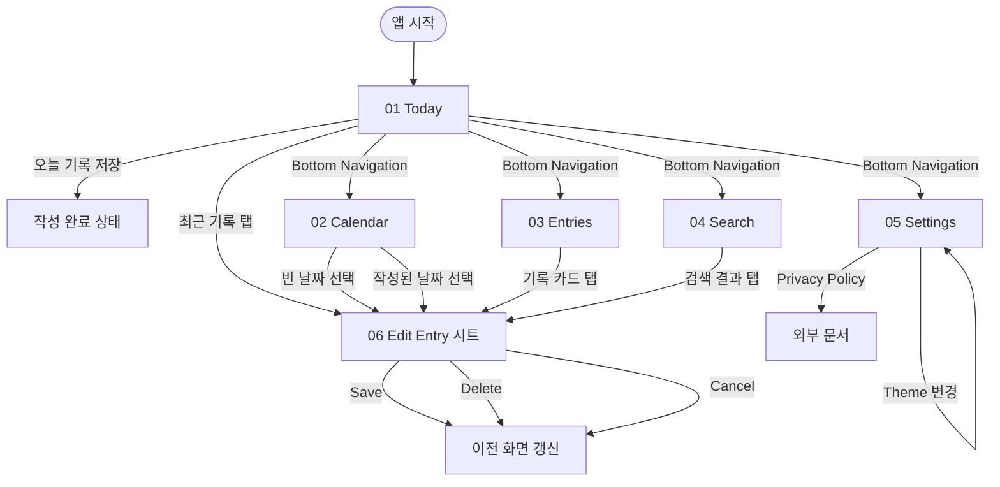

# OneLine Day — Screen Index

## 현재 상태

- ✅ Product concept: **One line per day**
- ✅ Documented screens: **6 / 6**
- ✅ Phase: **문서화 우선 기획 + Android/iOS 기본 스캐폴드** — 실제 화면 구현은 후속 PR에서 진행

OneLine Day는 인증·서버·사진 없이 시작하는 개인용 데일리 로그 앱이다. 사용자는 하루에 한 줄만 작성하고, 나중에 캘린더·목록·검색으로 다시 확인한다.

---

## MVP 범위

### 포함

- 날짜당 1개 기록 작성/수정/삭제
- 오늘 기록 빠른 진입
- 월간 캘린더에서 작성일/빈 날짜 구분
- 전체 기록 최신순 목록
- 텍스트 검색
- 테마 설정과 앱 정보
- 광고 배치 슬롯 정의: Today 하단, Entries 하단 중심

### 제외

- 계정/로그인
- 서버 동기화
- 사진 첨부
- 소셜 피드/팔로우/댓글
- 태그, 감정 점수, AI 요약
- 전면 광고 또는 저장 직후 강제 광고

---

## 화면 목록

| # | Screen | 분류 | File | 핵심 액션 |
|---|---|---|---|---|
| 01 | Today | 메인 | [01-today.md](01-today.md) | 오늘 한 줄 작성/수정 |
| 02 | Calendar | 탐색 | [02-calendar.md](02-calendar.md) | 날짜 선택 후 기록 확인/작성 |
| 03 | Entries | 탐색 | [03-entries.md](03-entries.md) | 전체 기록 최신순 탐색 |
| 04 | Search | 탐색 | [04-search.md](04-search.md) | 키워드로 기록 검색 |
| 05 | Settings | 설정 | [05-settings.md](05-settings.md) | 테마/앱 정보/정책 확인 |
| 06 | Edit Entry | 작성 시트 | [06-edit-entry.md](06-edit-entry.md) | 선택 날짜 기록 저장/삭제 |

---

## 화면 흐름



---

## 공통 내비게이션

v1은 5개 탭을 사용한다. 작성은 별도 탭이 아니라 Today와 선택 날짜에서 진입하는 시트로 처리한다.

| index | label | route | icon 의미 |
|---|---|---|---|
| 0 | Today | `today` | 오늘 |
| 1 | Calendar | `calendar` | 월간 보기 |
| 2 | Entries | `entries` | 전체 기록 |
| 3 | Search | `search` | 검색 |
| 4 | Settings | `settings` | 설정 |

---

## 공통 데이터 모델

```text
Entry
- id: stable local id
- date: local calendar date, unique
- text: 1..200 characters
- createdAt: created timestamp
- updatedAt: updated timestamp

Settings
- themeMode: system | light | dark
- firstLaunchAt
- lastOpenedAt
```

---

## 공통 DS 컴포넌트 사용 계획

| 목적 | DS component |
|---|---|
| 주요 액션 | `design_system/docs/components/01-button.md` |
| 한 줄 입력 | `design_system/docs/components/10-textarea.md` |
| 검색 입력 | `design_system/docs/components/02-text-field.md` |
| 기록 카드 | `design_system/docs/components/06-card.md` |
| 텍스트 | `design_system/docs/components/16-label.md` |
| 하단 탭 | `design_system/docs/components/23-bottom-navigation.md` |
| 상단 제목/액션 | `design_system/docs/components/25-top-navigation.md` |
| 빈 상태 | `design_system/docs/components/22-fallback-view.md` |
| 토스트/에러 | `design_system/docs/components/08-snackbar.md` |
| 확인 모달 | `design_system/docs/components/18-alert.md` |
| 구분선 | `design_system/docs/components/17-divider.md` |
| 테마 토글/선택 | `design_system/docs/components/24-list-item.md` |

---

## 광고 배치 원칙

- 광고는 핵심 CTA 바로 위/아래에 붙이지 않는다.
- Today와 Entries 하단에 안전 여백을 둔 배너 슬롯을 우선한다.
- 저장 성공, 삭제 확인, 탭 전환 직후 전면 광고는 v1 범위에서 제외한다.
- 광고 영역은 콘텐츠와 명확히 분리하고 레이아웃 점프를 만들지 않는다.

---

## 후속 구현 체크리스트

1. 로컬 저장소 선택 및 ADR 작성
2. 화면 명세 검증 스크립트 실행
3. Today → Edit Entry → Calendar 순서로 실제 기능 구현
4. AdMob 테스트 광고 ID와 정책 문서 링크 연결
5. 앱 아이콘/런치 이미지 교체
